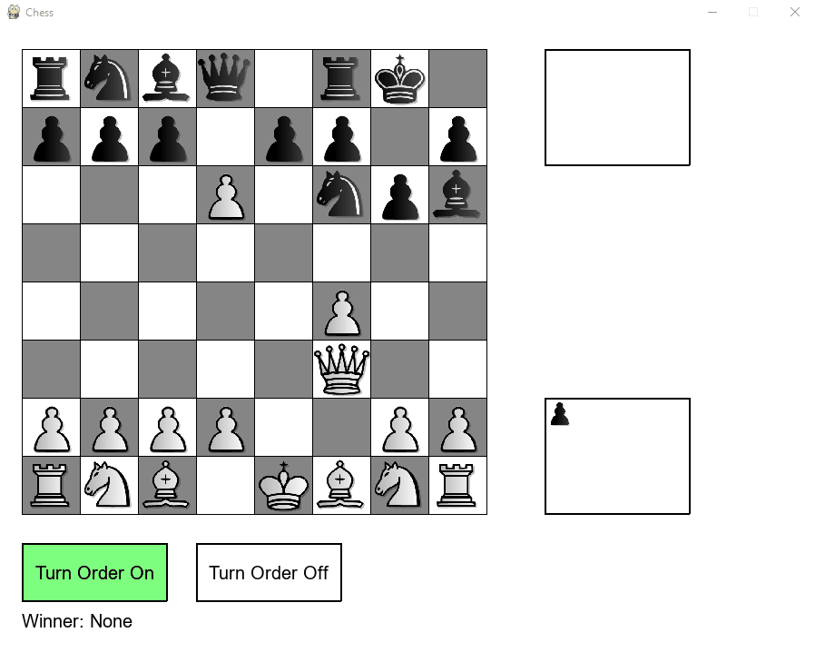
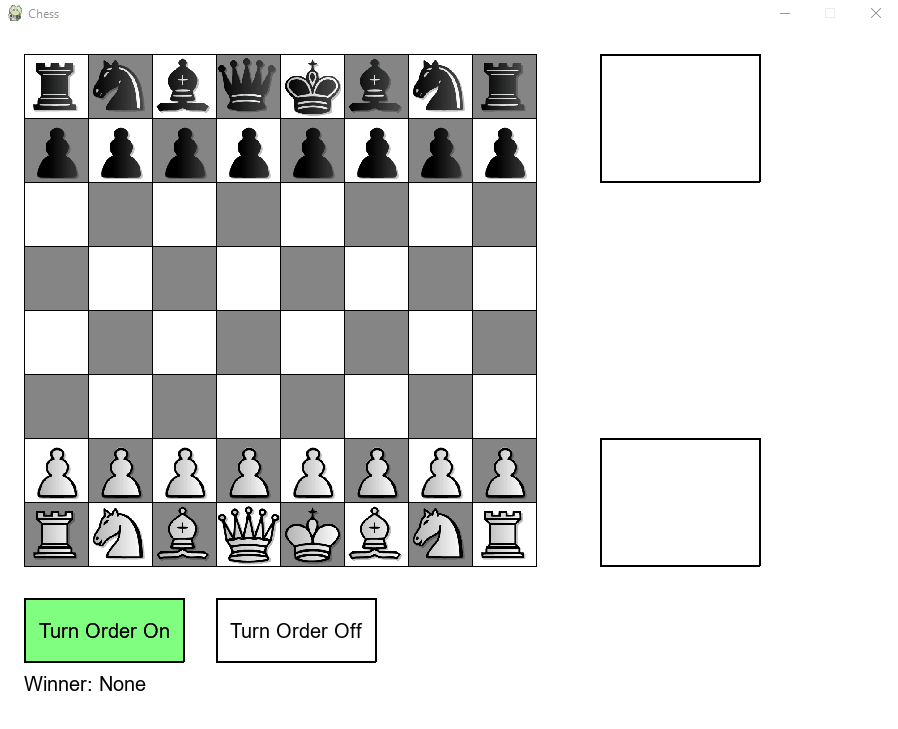
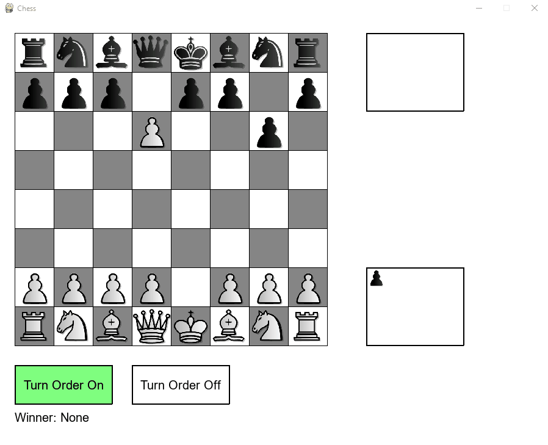
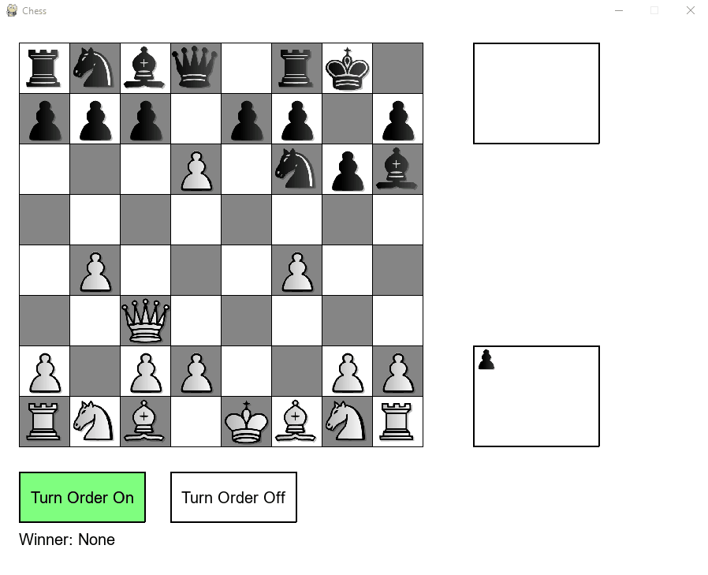

# Chess
Basic local multiplayer Chess game with a couple additional features.

## Technologies
Python 3.8

PyGame Library

## Features
This implementation of Chess includes the ability to pick up and drop pieces with the mouse. When picking up a piece, legal move positions are light up yellow. Game prevents you from all illegal moves from basic piece rules to more complicated ones like self-checking or illegal king castling. Many niche features are implemented such as En Passant as well as castling. Check and checkmate are correctly coded and there is a debug feature at the bottom that lets you turn off turn order in order to move the same color multiple times in succession. On the side of the screen is a box showing previously captured pieces for each team. The only functionality that is noticeably missing is Pawn promotion not being implemented and the ability to declare a draw (and any associated draw condition checks).

## Approach
Keeping separation of concerns in mind when starting this project, I tried to keep UI features, piece logic, game data, and display code all separate. Chess piece sprites are moved around using detection of mouse up and mouse down events. When a mouse down occurs, the game checks if any sprite is currently collided with and replaces the mouse with that sprite. This gives the impression that the piece was picked up and can be moved around with the mouse. Upon a mouse up, the pixel location is recorded and used to determine where the nearest possible cell is and then attempts to move the sprite there.

This is where the more complicated section of move validation comes in. This is solved via a two step system. First, at the start of the game and any time the mouse button is released, the game clears previous knowledge of where each piece is and then updates all known positions. It then goes through each piece in the game and updates its move bank in a first pass, adding all moves that could land the piece in a blank spot or onto an enemy piece into a move bank. Initially this seems sufficient, but issues arise when needing to implement the inability to self-check. A piece may look to have a legal move, but if it would self-check, it actually isn't legal. So after all pieces have their first pass for legal moves, it then runs through them a second time testing each potential move and then evaluating every opponents possible moves to see if a self-check has occured. If it determines a specific move would cause self-check, it is removed from the move bank for that piece.

The above method may not be optimal, as logically it seems like there may be a way to implement it without the first pass (if we re-evaluate each move again after anyway), but on testing it it was still quick enough to happen instantly.

Once the ability to self-check is removed, the rest of implementation of check and checkmate is simple. Check is already resolved, since if a player is in check and they don't end it, they would be ending their turn with a self-check. In practice, almost all pieces have their available moves removed and the only valid move is from pieces that could end the check (including the King moving out of check). Similarly, proving checkmate is easy by just keeping a list of all possible moves a given team has. If a color's collective move bank is ever empty, it is only due to a checkmate situation and a winner can be declared.

## Images and GIFs

Starting chess position, White to move first:

Demonstration of highlighting legal moves:

Rejection of an illegal move:

Several moves, ending in an En Passant:

Several more moves, ending in a castle:

Demonstration of forcing a player to exit check:

Demonstration of checkmate:

